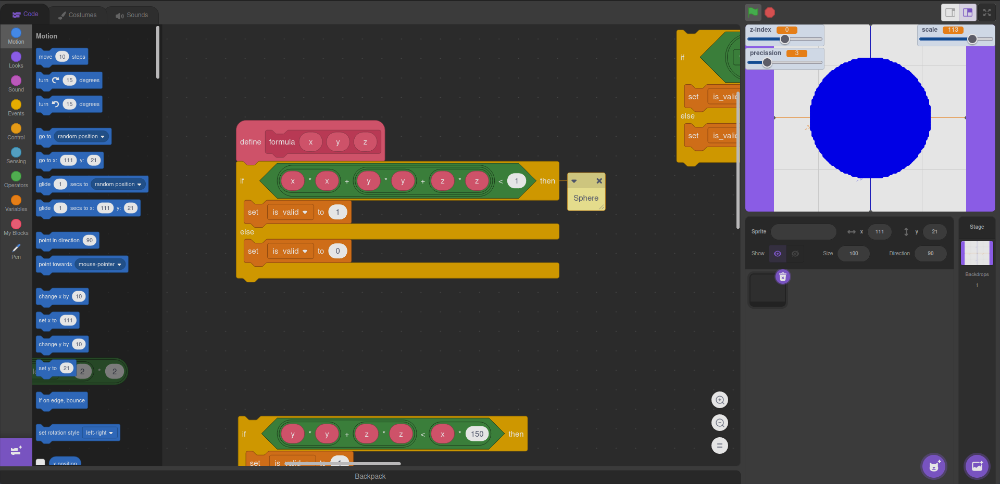

# 3D viewer
This project has a basic 3D formula viewer where you can adjust z-index to view, scale, precission... (still indev)

There might be a [working online wersion](https://scratch.mit.edu/projects/909665328/editor/)

# Instructions
## 3D Viewer (indev)
This is a 3D formula viewer, it just goes point by point checking an equation and drawing the point if it succeeds (modify the source code to change the formula, there's some dead code of alternative examples).
By design it will perform better on inecuations rather than equalities, but some of them could work fine enough.

## User Variables
* z-index: z plane to render
* precission: separantion between points to be checked on the function (higher number less precise)
* scale: scale the formula, useful to view 1x1 spheres in the scale of the viewer (150x150)

## Redraw
press space to force a formula redraw
redraws are automatically triggered after changing the value of `z-index`, `precission` or `scale`

# Notes and Credits
This code is licensed under [GPLv3](https://www.gnu.org/licenses/gpl-3.0.txt) (idk, if I can even do this in scratch lol)
