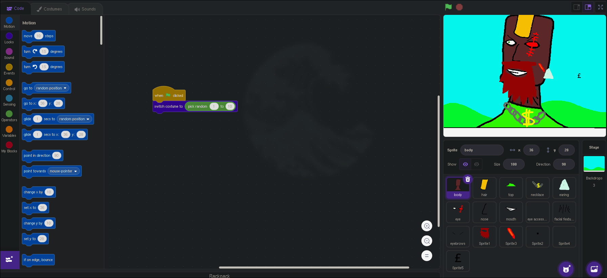

# NFT randomizer
This is a project that makes super high quality and noice NFTs so you can share it with your NFT buddies 👍
Here is the online scratch version: https://scratch.mit.edu/projects/629205360
 
 
 # Instructions
 ## NFT Randomizer
 Click start and boom a new NFT for you my deary

 # Notes and Credits
 The awesome DeaDvey (best human) licensed under [GPLv3](https://www.gnu.org/licenses/gpl-3.0.txt) (idk, if I can even do this in scratch lol)

I did NOT copy and paste javalsais words btw I am original 😁
