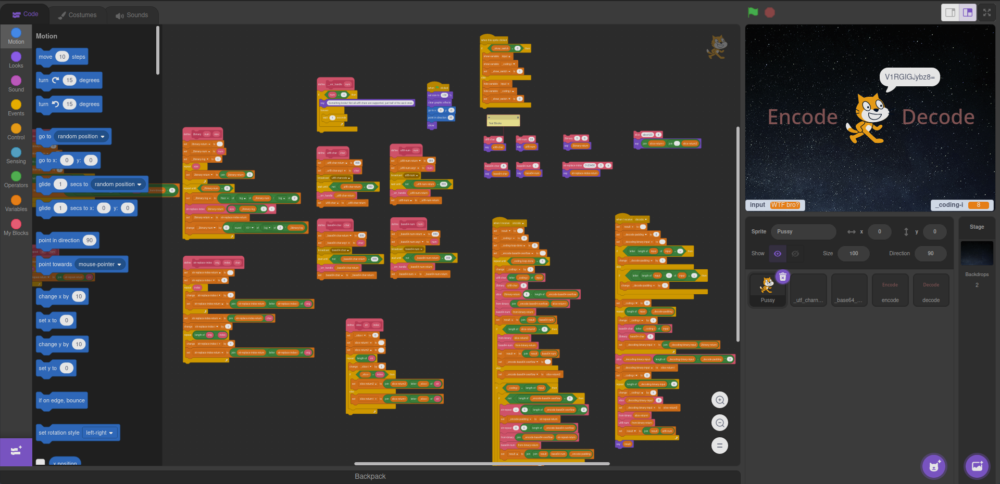

# Base64
This project has a base64 encoder and decoder for most ASCII characters.

There might be a [working online wersion](https://scratch.mit.edu/projects/897156460/)

# Instructions
Pretty obvious (click exactly on the letter tho lol)

And be patient, is really slow (I would say about 1s per letter)

# Notes and Credits
## Note:
uggggh, my head hurts?

## Credits:
* Inexplicable will to code when my head hurts, entering in a vicious cycle
* Scratch not being able to perform case sensitive matches and having to do weird bodges
* Scratch not allow functions to have return values and everything being a global variable that requires perfect syncing
* Scratch not being able to do powers and allowing the "simple": 10^(log(base)*exponent)
* Scratch not having basic functions to work with strings or converts numbers to binary back and forth
* Scratch not allowing you to get the utf8 number of a character
* Scratch costumes taking forever to change compared to *way* more complex functions
* Scratch killing computing power when `forever{wait(1s);}`

Wouldn't have been possible without all that
