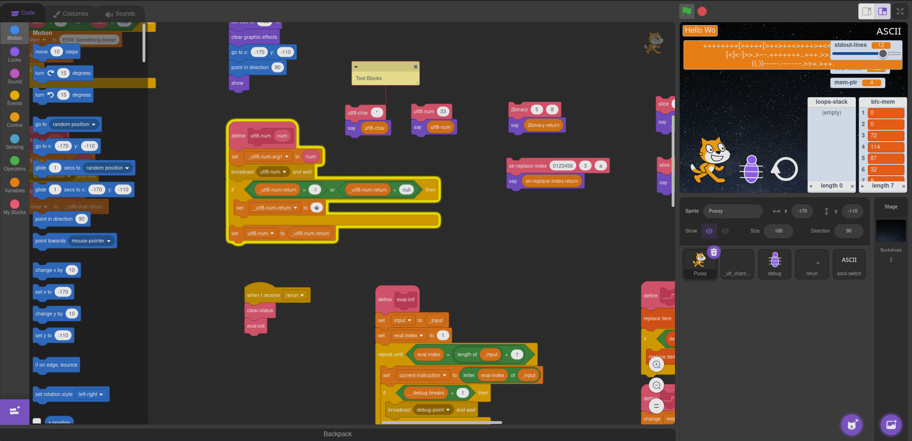

# Brainfack
This project is a bainfuck interpreter (can't name projects with fuck in scratch) with features to debug and more.
You might be able to get awesome performance on things like the game of life in brainfuck if you play with local compilers.

There might be a [working online wersion](https://scratch.mit.edu/projects/904297818/editor/)

# Instructions
Click on cat to run some code
Click on debug icon to change debug mode between:
* Disabled & hidden
* Disabled & visible
* Enabled by sleep (hold \<space> to speed up a bit)
* Enabled by manual breakpoints
Click on reload button to rerun the same code

# Notes and Credits
## Note:
Made the interpreter in 1h lol, added additional features on another couple more
Shortcuts:
* i: switch input visibility (can speed execution considerably on programs like the Conway game of life (yes, it works, kinda))
* d: interact with debug
* r: rerun
* a: ASCII switch (see blow what it is)
* <space>: speed up in debug sleep mode

## Other
The preloaded program is https://www.linusakesson.net/programming/brainf%75ck/index.php (crashes after a while, idk why). If you want you could do F12 and modify the stdout variable styles to include `font-family: mono` and `line-height: 1em`.

## About ASCII Switch
Switches on how input and output is shown, either ASCII mode (might be slower on i/o operations) or the output bytes numbers (should be faster)

## Credits:
* Based from https://scratch.mit.edu/projects/897156460/
* And thanks to the god who had the idea of https://en.scratch-wiki.info/wiki/How_to_Use_Multiple_Lines_in_Scratch_Projects
and the other one who coded the feature of editing compressed tarballs/zips in vim (or was it nvim, idk).
